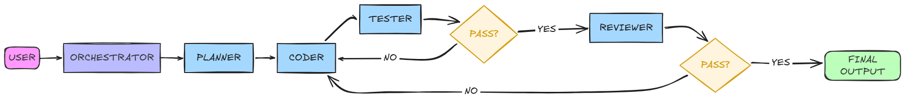

# AI Coding Agent

A small multi-agent system I built to learn [deepagents](https://github.com/langchain-ai/deepagents) and LangGraph. You give it a coding requirement in plain English, and a team of AI subagents plans, writes, tests, and reviews the Python code for you.

Built with Google Gemini (free tier), so it's a fun weekend project rather than anything production-grade.

## How it works

A main coordinator agent doesn't write any code itself — it just delegates to four specialists, one after another:

1. **Planner** — breaks your requirement into a short plan (max 5 steps).
2. **Coder** — writes the actual Python code from that plan.
3. **Tester** — runs the code and checks it actually works.
4. **Reviewer** — checks the result against your original ask and returns the final code.

If a step fails, the coordinator sends it back for a fix instead of just giving up.



## Project structure

```
AI-Coding-Agent
├─ main.py           # wires everything together and runs the agent
├─ middleware.py      # logging + loop/iteration guard
├─ prompts.py          # system prompts for each agent
├─ schemas.py          # structured response formats
├─ tools/               # code execution + syntax validation tools
├─ requirements.txt
└─ test_tools.py
```

## Running it

```bash
pip install -r requirements.txt
```

Add your Groq API key to a `.env` file:

```
GROQ_API_KEY=your_key_here
```

Then run:

```bash
python main.py
```

## Why I built this

Mostly to actually understand how multi-agent coordination, subagent delegation, and middleware work in practice — not just in theory. It's rough around the edges on purpose; there's a decent list of things I learned the hard way (rate limits, empty model responses, agents summarizing code instead of passing it verbatim) that shaped how this ended up structured.

## Notes

- This is a learning project, not something meant to run untrusted code in production. Don't point it at anything sensitive.
